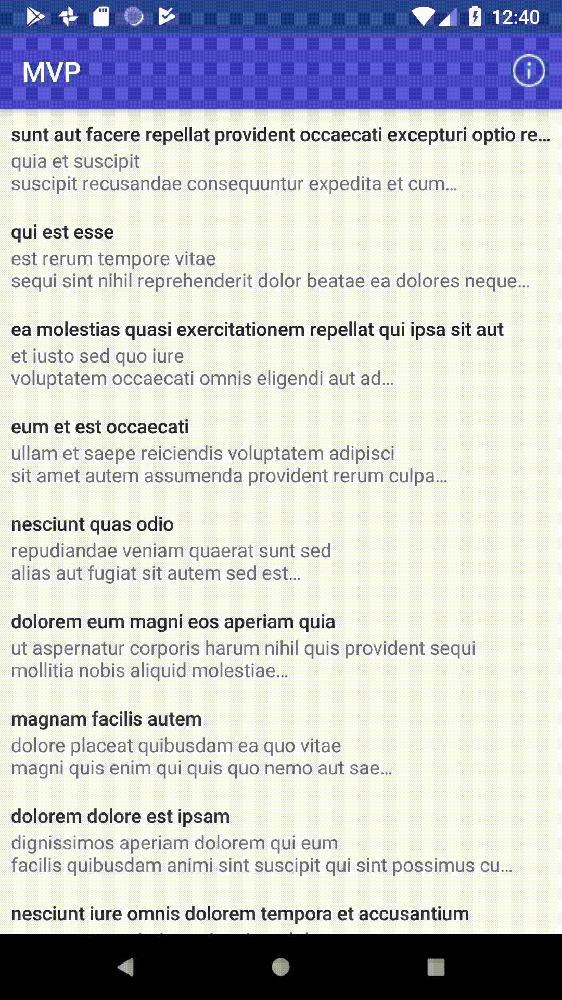

# Kotlin + MVP + Dagger 2 + Retrofit

A sample application that shows how to use **MVP** with **Dagger2**,**Retrofit** and **RxJava2** in Kotlin.
   
It fetches data from [typicode api](https://jsonplaceholder.typicode.com).

  

